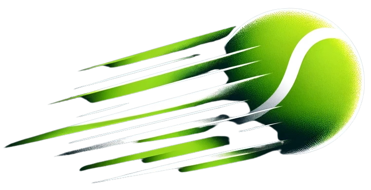

# CourtCheck

<div align="center">
  
  
  <h3>AI-Powered Tennis Match Analysis</h3>
  
  [](https://modal.com)
  [](LICENSE)
  [](https://www.python.org/)
  [](https://reactjs.org/)
</div>

---

## Overview

CourtCheck is a computer vision platform that analyzes tennis match videos to provide:
- **Ball tracking** with TrackNet deep learning model
- **Court detection** using Detectron2 keypoint detection
- **Player movement** analysis and heatmaps
- **Shot statistics** and performance metrics
- **Real-time processing** via serverless GPU compute

### Key Features

🎾 **Automatic Ball Detection** - Track ball movement throughout the match  
🏟️ **Court Mapping** - Detect court boundaries and lines  
👥 **Player Tracking** - Identify and track player positions  
📊 **Analytics Dashboard** - Visualize match statistics  
☁️ **Cloud Processing** - Scalable GPU compute via Modal  
🚀 **Web Interface** - Easy drag-and-drop video upload

---

## Quick Start

### Prerequisites

- Python 3.10+
- Node.js 14+
- [Modal account](https://modal.com) (free tier available)

### 1. Install Dependencies

```bash
# Backend
pip install -r requirements.txt

# Frontend
cd frontend && npm install
```

### 2. Deploy Backend

```bash
# Setup Modal
pip install modal
modal token new

# Deploy
modal deploy modal_deploy.py
modal deploy modal_web_api.py
```

### 3. Launch Frontend

```bash
cd frontend

# Set API URL (from Modal deployment)
echo "REACT_APP_API_URL=https://[your-modal-url].modal.run" > .env

# Start
npm start
```

Visit `http://localhost:3000` and upload a tennis match video! 🎾

---

## Architecture

```
┌─────────────┐      ┌──────────────┐      ┌─────────────┐
│   Frontend  │─────▶│  Modal API   │─────▶│   GPU VM    │
│   (React)   │      │  (FastAPI)   │      │ (A10G/T4)   │
└─────────────┘      └──────────────┘      └─────────────┘
                            │                      │
                            │                      │
                     ┌──────▼──────┐        ┌──────▼──────┐
                     │   Volumes   │        │   Models    │
                     │  (Storage)  │        │  (TrackNet) │
                     └─────────────┘        └─────────────┘
```

### Components

- **Frontend**: React app with drag-and-drop video upload
- **Modal API**: FastAPI web endpoints for video processing
- **GPU Processing**: TrackNet + Detectron2 models on Modal
- **Storage**: Modal volumes for video I/O
- **Models**: Pre-trained TrackNet weights in Docker image

---

## Project Structure

```
courtCheck/
├── frontend/                 # React web application
│   ├── src/
│   │   ├── components/      # UI components
│   │   │   ├── VideoUpload.js
│   │   │   ├── Dashboard.js
│   │   │   └── ...
│   │   └── App.js
│   └── public/
├── modal_deploy.py          # Core processing functions
├── modal_web_api.py         # Web API for frontend
├── ball_detection.py        # TrackNet ball detection
├── court_detection_module.py # Court keypoint detection
├── video_processor.py       # Video processing pipeline
├── upload_video_local.py    # CLI video upload
├── models/
│   └── weights/
│       └── tracknet_weights.pt
├── CourtCheck/              # Original model implementations
│   └── models/
│       └── TrackNet/
└── DEPLOYMENT.md           # Complete deployment guide
```

---

## Usage

### Web Interface (Recommended)

1. Open the web app at `http://localhost:3000`
2. Drag and drop a tennis match video (MP4, MOV, AVI)
3. Wait for processing (2-5 minutes depending on video length)
4. View results and download processed video with ball tracking

### Command Line

```bash
# Upload video
python upload_video_local.py "path/to/video.mp4" "my_video.mp4"

# Process video
modal run modal_deploy.py::process_video \
  --video-path "/videos/my_video.mp4" \
  --output-path "/videos/my_video_output.mp4"

# Download result
modal run modal_deploy.py::download_result \
  --remote-video-path "/videos/my_video_output.mp4" \
  --local-output-path "output.mp4"
```

---

## Technology Stack

### Backend
- **Modal**: Serverless GPU compute
- **PyTorch**: Deep learning framework
- **Detectron2**: Facebook AI's detection library
- **TrackNet**: Ball tracking model
- **OpenCV**: Computer vision operations
- **FastAPI**: Web API framework

### Frontend
- **React**: UI library
- **Tailwind CSS**: Styling
- **Chart.js**: Data visualization
- **Webpack**: Build tool

### Models
- **TrackNet**: Tennis ball detection and tracking
- **Detectron2**: Court keypoint detection (optional)
- **YOLOv8**: Player detection (optional)

---

## Features in Detail

### 1. Ball Tracking

Uses TrackNet, a deep learning model trained specifically for tennis ball detection:
- Real-time tracking across frames
- Handles occlusion and fast movements
- Outputs ball trajectory overlays

### 2. Court Detection

Detectron2-based keypoint detection for court boundaries:
- Identifies 14 key court points
- Computes homography transformation
- Maps court to 2D top-down view

### 3. Video Processing Pipeline

1. **Scene Detection**: Split video into rallies
2. **Ball Detection**: Track ball in each frame
3. **Court Detection**: Identify court boundaries
4. **Player Detection**: Track player positions
5. **Composition**: Overlay all detections on video

### 4. Analytics

- Shot heatmaps
- Rally duration
- Ball speed estimation
- Player movement patterns

---

## Deployment Options

### Development

```bash
# Backend
modal serve modal_web_api.py

# Frontend
cd frontend && npm start
```

### Production

#### Backend (Modal)
```bash
modal deploy modal_deploy.py
modal deploy modal_web_api.py
```

#### Frontend Options

**Vercel** (Recommended):
```bash
cd frontend
vercel
```

**Netlify**:
```bash
cd frontend
netlify deploy --prod
```

**Docker**:
```dockerfile
FROM node:18-alpine
WORKDIR /app
COPY frontend/ .
RUN npm install && npm run build
CMD ["npm", "start"]
```

---

## Configuration

### Environment Variables

**Frontend** (`.env`):
```env
REACT_APP_API_URL=https://[your-modal-url].modal.run
```

**Backend** (Modal secrets):
```bash
modal secret create courtcheck-secrets \
  AWS_ACCESS_KEY_ID=xxx \
  AWS_SECRET_ACCESS_KEY=xxx
```

---

## Cost Estimation

**Modal Pricing** (as of 2024):
- A10G GPU: ~$1.10/hour
- Processing time: 2-5 minutes per video
- **Cost per video**: $0.04-$0.10

**Free Tier**: $30/month credits = ~300-750 videos/month

---

## Troubleshooting

### Common Issues

**Frontend can't connect to API**:
- Check `REACT_APP_API_URL` in `.env`
- Verify Modal deployment: `modal app list`
- Test health endpoint: `curl [api-url]/api/health`

**Video processing fails**:
```bash
# Check logs
modal app logs courtcheck-web

# Verify model weights
modal volume get courtcheck-models
```

**Out of memory**:
- Use larger GPU: Change `gpu="A10G"` to `gpu="A100"`
- Reduce video resolution before upload

See [DEPLOYMENT.md](DEPLOYMENT.md) for detailed troubleshooting.

---

## Development

### Setup

```bash
# Clone repository
git clone https://github.com/yourusername/courtcheck.git
cd courtcheck

# Install dependencies
pip install -r requirements.txt
cd frontend && npm install

# Setup Modal
modal token new
```

### Run Tests

```bash
# Backend
pytest

# Frontend
cd frontend && npm test
```

### Code Style

```bash
# Python
black .
flake8 .

# JavaScript
cd frontend && npm run lint
```

---

## Contributing

We welcome contributions! Please see [CONTRIBUTING.md](CONTRIBUTING.md) for guidelines.

1. Fork the repository
2. Create your feature branch (`git checkout -b feature/amazing-feature`)
3. Commit your changes (`git commit -m 'Add amazing feature'`)
4. Push to the branch (`git push origin feature/amazing-feature`)
5. Open a Pull Request

---

## License

This project is licensed under the MIT License - see [LICENSE](LICENSE) file for details.

---

## Acknowledgments

- **TrackNet**: Original paper by Huang et al. (2019)
- **Detectron2**: Facebook AI Research
- **Modal**: Serverless GPU platform
- **Contributors**: All our amazing contributors!

---

## Citation

If you use CourtCheck in your research, please cite:

```bibtex
@software{courtcheck2024,
  title={CourtCheck: AI-Powered Tennis Match Analysis},
  author={Your Name},
  year={2024},
  url={https://github.com/yourusername/courtcheck}
}
```

---

## Support

- 📖 **Documentation**: [DEPLOYMENT.md](DEPLOYMENT.md)
- 🐛 **Issues**: [GitHub Issues](https://github.com/yourusername/courtcheck/issues)
- 💬 **Discussions**: [GitHub Discussions](https://github.com/yourusername/courtcheck/discussions)
- 📧 **Email**: support@courtcheck.ai

---

<div align="center">
  <p>Made with ❤️ for tennis players and coaches</p>
  <p>
    <a href="#quick-start">Get Started</a> •
    <a href="DEPLOYMENT.md">Deployment Guide</a> •
    <a href="#features-in-detail">Features</a> •
    <a href="#contributing">Contributing</a>
  </p>
</div>
